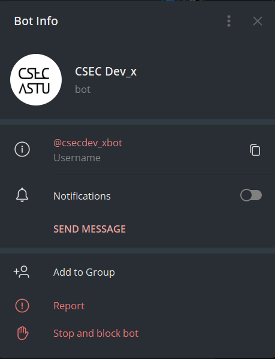
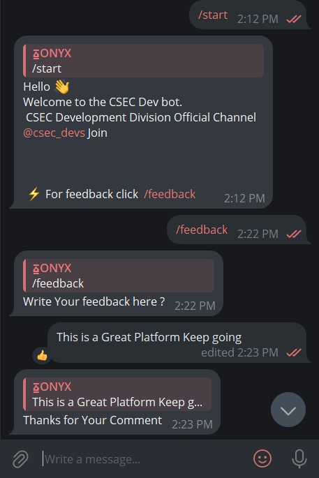

# CSEC Dev Management 

### What is CSEC Dev Management website ❓

The CSEC Dev Web Management System is a robust platform designed to effectively handle and manage club members. This web-based system offers a range of essential functionalities to facilitate seamless management of club member data. Users can conveniently register, delete, and edit their profiles through the site's user-friendly interface. Moreover, the system provides comprehensive support for managing club events and incorporates various features to cater to diverse needs. Administrators can effortlessly generate reports on user data, enabling insightful analysis and informed decision-making. Additionally, the system boasts advanced data visualization capabilities, allowing for the clear and visually appealing representation of data. By leveraging these features, the CSEC Dev Web Management System empowers organizations to streamline their club member operations and enhance overall efficiency.

### Main features ❓

> Data **visualization** 📊
>
> 
> Integrate with **Telegram** Bot :dependabot:
>
> 
> Using **Session** ⏲️
> 
>
> Responsive in Mobile size and Tablet Mode 📱
>
> 
> Beautyfull UI(user interface) and UX(user expirance) 🖥️
>
> Desgin using Figma

### Technology Stack ❓

- **Databse** : SQL(sqlite3) and GoogleSheet
* **Cleint Side** : HTML5 , CSS3 and Javasciript
* **Server Side** : Django(Python)
+ **CSS Framework** : BULMA Framework
+ **Bot Development** : Telesun(Javascript Library) and telebot(Python Library)
+ **Version Control** : Git

### Demo Password

> Login Page INFO

      💻 Username: admin
      
      🔑 Password:  admin

> Django Admin INFO

        💻 Username : admin
        
        🔑 Password: onyx123

### User Interface ❓

Servant Telegram Bot(to recive feedback from user and dispay on web)

Implementaion

Login Page

Login in Mobile View

Members Page

Adding new member page

Event Handling Page

Posting text from web to telegram

accepting feedback from telegram bot and display on web

In Mobile View (Feedback)

Analyzing and reporting Page

Desgin Process : using Figma

